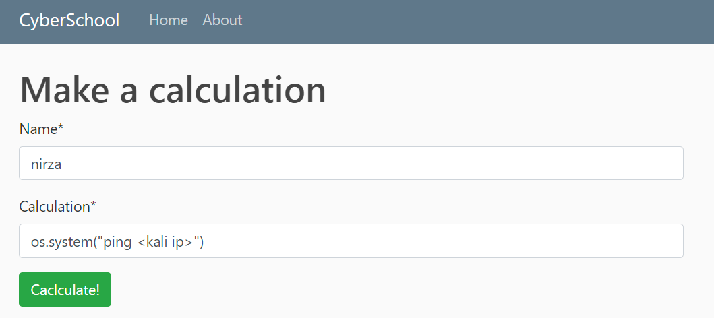
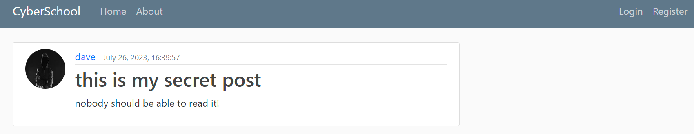
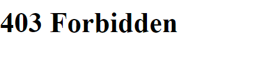

In order to get better at whitebox pentesting I started writing an web app in django.

During the building of this app I inserted inbuilt vulnerabilities that one can look up for them.

Also in this note I will explain how to exploit the vulnerabilities I inserted in purpose to the app and how to patch them, have fun!

You can run the image by using:

```
docker run -it -p 8000:8000 nirzaaa/django-cyberschool
```

And then open the app at `localhost:8000`


## Command Injection

As you can see at `main -> views.py` we are making use of eval which might lead to RCE.

In order to exploit it we will go to: http://127.0.0.1:8000/calculation/ and then:




I tried to patch it by using `match`, is it enough? hmmm...

```python
# ==== The vulnetable code ==== #

result = eval(t)
return render(response, "main/show.html", {"t":t, "result":result, "hacker":False})

# ============================= #

# ==== The patch ==== #

x = re.match("[a-zA-Z]", t)
if x:
    hacker = True
    return render(response, "main/show.html", {"hacker":hacker})
else:
    hacker = False
    result = eval(t)
    return render(response, "main/show.html", {"t":t, "result":result, "hacker":hacker})

# =================== #
```


## IDOR

Let's go to `New Post` and try to create a new post.

We just created a post! yay!! But we don't want anyone else to see it of course!

I went to `main -> views.py` and had to made a modification in order to require login and also to check the user identity.

As you can see I'm able to see dave's post without the need to login as him:





But with the patch we are getting as needed:





```python
# ==== The vulnerable class ==== #

class PostDetailView(DetailView):
    model = Post

    def form_valid(self, form):
        form.instance.author = self.request.user
        return super().form_valid(form)
    
# ============================== #

# ==== The patch ==== #

# class PostDetailView(LoginRequiredMixin, UserPassesTestMixin, DetailView):
#     model = Post

#     def form_valid(self, form):
#         form.instance.author = self.request.user
#         return super().form_valid(form)
    
#     def test_func(self):
#         post = self.get_object()
#         if self.request.user == post.author:
#             return True
#         return False

# ===================== #
```


## pickle deserialization

Now it's the pickle time!!

We can upload our resume as a pickle file, which might lead us to pickle deserialization!

I also added the `evil_pickle.py` file which might help in getting the .pkl to upload in order to get rce.

You can start by creating your malicious pickle file with:

```
python evil_pickle.py
```

Now we are able to go to:

http://127.0.0.1:8000/resume/ and upload our `.pkl` file.

Your AV might get mad at you ;)

Never trust a pickle I guess, a part from pickle rick of course!!

## SSTI Injection

Now it's the time to exploit the template!

You can try to play with it to get RCE on the machine, while going to:

http://127.0.0.1:8000/ssti/

I also added 2 patches which are commented out at `main -> views.py` which you can try to use in order to patch the issue:

```python
def ssti(request):

    from jinja2 import Template

    cmd = request.GET.get("cmd")
    
    template = Template(f'Hello {cmd}!')

    if cmd:
        print(template.render())
        return HttpResponse("Thank you for the input")
    else:
        return HttpResponse("No input provided - enter ?cmd=")

    # ====== patch 1 ====== # 

    # cmd = request.GET.get("cmd")

    # if cmd:
    #     return render(request, 'main/ssti_vul.html', {'cmd':cmd})
    # else:
    #     return HttpResponse("No input provided")


    # ====== patch 2 ====== #

    # s_form = Ssti()

    # context = {
    #     's_form': s_form,
    # }

    # return render(request, 'main/ssti.html', context)
```


P.S. 

Moreover, under `flask_stuff` folder you can find a flask application which is vulnerable to SSTI too:
```python
from flask import Flask, request, render_template_string

app = Flask(__name__)

@app.route('/')
def index():
    search = request.args.get('search') or None

    template = '''
                <p>hello world</p>
                {}
    '''.format(search)

    return render_template_string(template)

if __name__ == '__main__':
    app.run(debug=True)
```

## Cookie based vulnerability


You can go to http://127.0.0.1:8000/visit/ and see if you can play with the session in order to misuse the `Visit count`

## XSS

We will create a login page based on manual cookie handling to be able to see how it works.

While creating the login we mistakenly used at `main -> templates -> main -> home_cookie.html`:

```
<h4>You are logged in as {{username | safe}}</h4>
```

Try to exploit it by using XSS (`<script>alert('XSS');</script>`), then get the admin cookie and try to login as the admin to the admin panel!!

How to patch this?? Hint: `SESSION_COOKIE_HTTPONLY = False`

## Scraping with authenticate session

I think it might be useful for some to scrape web apps after getting session authentication, so I added the file `authenticate_script.py` which does just that ;)
